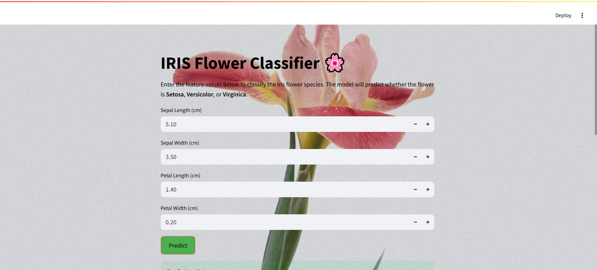
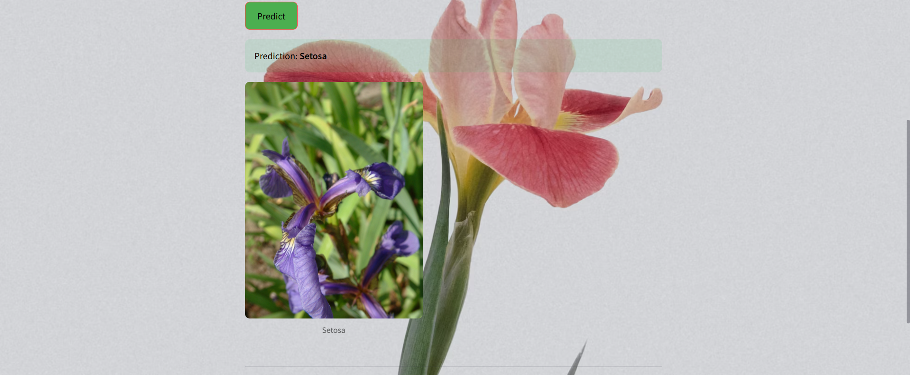

# **Model Deployment as API | The Iris Dataset**

Deploying a Machine Learning Model as a REST API with Flask


---

## **Data Set Information**

This is perhaps the best-known database in the pattern recognition literature. The data set contains 3 classes of 50 instances each, where each class refers to a type of iris plant. One class is linearly separable from the other two; the latter are NOT linearly separable from each other.

**Predicted attribute**: Class of iris plant.

---

## **Attribute Information**

1. Sepal length in cm  
2. Sepal width in cm  
3. Petal length in cm  
4. Petal width in cm  
5. Class:  
   - Iris Setosa  
   - Iris Versicolour  
   - Iris Virginica  

---

## **Features**

- **Flask API**:
  - Endpoint `/predict` accepts feature arrays and returns predictions.
  - Enabled **CORS** to allow cross-origin requests from the Streamlit app.
- **Streamlit Frontend**:
  - Interactive UI for users to input feature values (Sepal Length, Sepal Width, Petal Length, Petal Width).
  - Displays prediction results dynamically.
  - Includes a visually appealing background and project-specific design.
- Pre-trained model based on the Iris dataset.

---

## **Steps**

1. Build and train the machine learning model in a Jupyter Notebook (file: `_model/Iris_model.ipynb`).
2. Save the model in a (pickle) file (file: `api/iris_model.pkl`).
3. Create an API application that uses the pre-trained model to generate predictions (file: `api/api.py`).
4. Add a **Streamlit frontend** for user interaction (file: `streamlit_app.py`).
5. Encapsulate the application in a Docker container (file: `api/Dockerfile`).
6. Deploy the application to a cloud server.

---

## **Technical Requirements**

+ Python 3.4+,
+ Docker,
+ The required Python libraries can be installed from the included `requirements.txt` file.

---

## **Running the Application Locally**

### **Directly**

```bash
# Clone the project
git clone https://github.com/AchilleasKn/flask_api_python.git

# Change Directory
cd flask_api_python/api

# Install pip for Python3
apt install python3-pip

# Install the requirements
pip3 install -r requirements.txt

# Run the Flask API
python3 api.py
```

### **On Docker**

###### Available images:
- `achilleaskn/flask_api_python:latest`
  - This image is based on the `python:3.6-jessie` official image.

  [](https://microbadger.com/images/achilleaskn/flask_api_python "Get your own image badge on microbadger.com")

- `achilleaskn/flask_api_python:alpine.latest`
  - This image is based on the Alpine Linux image, which is a lightweight version of Linux.

  [](https://microbadger.com/images/achilleaskn/flask_api_python:alpine.latest "Get your own image badge on microbadger.com")

##### From Scratch

```bash
# Clone the project
git clone https://github.com/AchilleasKn/flask_api_python.git

# Change Directory
cd flask_api_python/api

# Build the Docker image
docker build -t flask_api .

# For the Alpine version, run the following:
# docker build -f Dockerfile.alpine -t flask_api .

# Run the Flask API image and expose port 5000
docker run -d -p 5000:5000 flask_api

# To see the running containers
docker ps

# To see the logs of the running container
docker logs <Container ID>
```

##### With Docker Pull

```bash
# Pull the Docker image
docker pull achilleaskn/flask_api_python:latest

# For the Alpine version, run the following:
# docker pull achilleaskn/flask_api_python:alpine.latest

# Run the Flask API image and expose port 5000
docker run -d -p 5000:5000 achilleaskn/flask_api_python:latest

# For the Alpine version, run the following:
# docker run -d -p 5000:5000 achilleaskn/flask_api_python:alpine.latest

# To see the running containers
docker ps

# To see the logs of the running container
docker logs <Container ID>
```

---

## **Testing the Application**

Once it is running, the API can be queried using HTTP POST requests. I recommend using [Postman](https://www.getpostman.com/) for testing.

**URL**: `http://0.0.0.0:5000/predict`

- **Sample query for "Setosa" type**:
  ```json
  {
      "feature_array": [4.9, 2.9, 1.2, 0.3]
  }
  ```

  **Response**:
  ```json
  {
      "prediction": [0]
  }
  ```

- **Sample query for "Versicolour" type**:
  ```json
  {
      "feature_array": [6.4, 3.2, 4.5, 1.5]
  }
  ```

  **Response**:
  ```json
  {
      "prediction": [1]
  }
  ```

- **Sample query for "Virginica" type**:
  ```json
  {
      "feature_array": [6.2, 3.1, 5.3, 2.4]
  }
  ```

  **Response**:
  ```json
  {
      "prediction": [2]
  }
  ```

---

## **Using the Streamlit Frontend**

The Streamlit app provides an interactive UI for users to input feature values and view predictions.

### **How to Run the Streamlit App**

1. Ensure the Flask API is running locally or deployed.
2. Start the Streamlit app:
   ```bash
   streamlit run streamlit_app.py
   ```
3. The app will open in your default browser at:
   ```
   http://localhost:8501
   ```

### **Streamlit App Features**
- Input fields for Sepal Length, Sepal Width, Petal Length, and Petal Width.
- A "Predict" button to send the input to the Flask API and display the result.
- Displays the predicted Iris species along with an image of the corresponding flower.

---


### **Streamlit App Interface**




*Replace this placeholder with an actual screenshot of the Streamlit app.*

---

## **Deployment**

### **Deploying the Flask API**
You can deploy the Flask API to platforms like **Heroku**, **AWS**, or **Render**:
1. Create a `Procfile`:
   ```
   web: gunicorn api:app
   ```
2. Deploy to Heroku:
   ```bash
   heroku create your-app-name
   git push heroku main
   ```

### **Deploying the Streamlit App**
Deploy the Streamlit app to [Streamlit Cloud](https://streamlit.io/cloud):
1. Sign up for Streamlit Cloud.
2. Connect your GitHub repository.
3. Select `streamlit_app.py` as the entry point.
4. Deploy the app.

---

## **Contributing**

If you'd like to contribute, follow these steps:
1. Fork the repository.
2. Create a new branch for your changes:
   ```bash
   git checkout -b feature/your-feature-name
   ```
3. Push your changes and submit a pull request.

---

## **License**

This project is licensed under the **MIT License**. See the [LICENSE](LICENSE) file for details.
